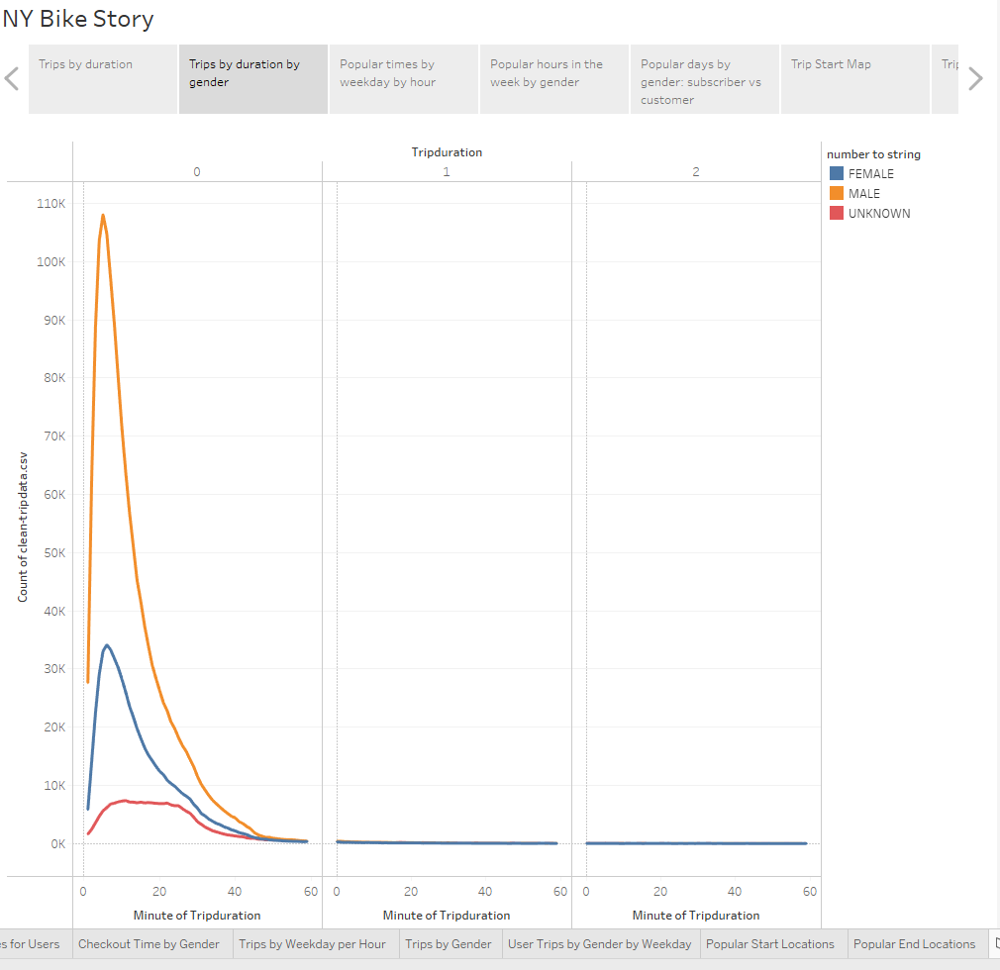

# bikesharing

<a href="https://public.tableau.com/app/profile/reed3429/viz/bikedata_challenge/NYBikeStory">Link to tableau story</a>

## Overview
The purpose of this analysis was to create data visualizations for CitiBike data in New York City, to inform potential investors about the viability of a similar program in Des Moines Iowa.

## Visualizations

### Trip Duration
The following graph shows a trend in trip duration, peaking around 10 minutes, and showing almost no trips longer than 1 hour.

### Trip Duration by Gender
The followig graph shows a similar trend in trip duration for both individuals that identify themselvesas males and females, but there are more male users than female users, and so that curve is above the female curve.

### Popular Trip Times
The following heatmap shows the number of trips at each hour of each weekday. It appears the most popular times are during commute times on weekdays around 8am and 5pm, although wednesday afternoon does not appear as popular. Additionally, trips on saturdays appear steady at each hour of the day but are most popular between 10am and 12pm.

### Trip Times by Gender
The same weekday trends are observed for both males and females, but the male heatmap is darker due to more trips.

### Trip Times by User-type
Male subscribers are the most popular usage group, and they are most active on weekdays. However, in the customer group, it appears that the weekend days are more popular than the weekdays.

### Trip Start and End Maps in NYC
The main takeaway from these two maps, that would pertain to Iowa, is that if one looks closely at the east side of the end map, in Jersey, that there are a number of bikes deposited there and no trips that start there. Bike retrieval will be a necessary cost and time commitment each day as some citibikes might end up further than expected.

## Summary
The most popular customer, where marketing efforts should be targeted, are males in the workforce with weekday commutes, and one-time-use customers on weekends. Two other interesting visualizations would be to repeat the trip time heatmap without subscription members and to make a bar graph of the top 25 start areas in order to figure out how many bikes to stock.